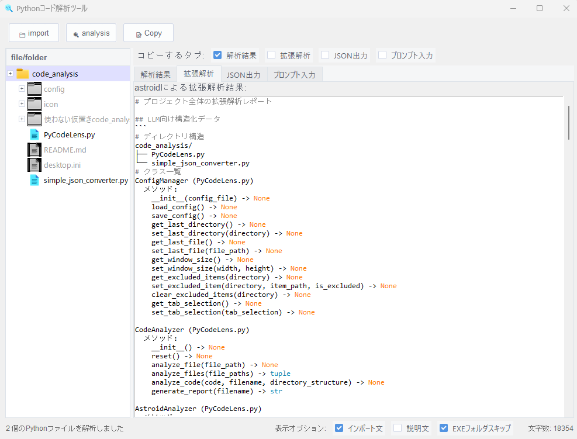

# 🔍 PyCodeLens: LLM向けPythonコード分析ツール

[](https://github.com/unhaya/pycodelens)
[](https://opensource.org/licenses/MIT)
[](https://www.python.org/downloads/)

> **LLMが複雑なコードベースに直面したとき、PyCodeLensがその目👀となります。**

PyCodeLensは、開発者が大規模言語モデル（LLM）と複雑なコードベースで作業するために特別に設計された強力なPythonコード分析ツールです。何千行ものコードでLLMを圧倒するのではなく、代わりに構造化された洞察を提供しましょう。

## 🌟 なぜPyCodeLensなのか？

ClaudeやGPTに大規模なコードベースを理解させようとしたことはありますか？大変ですよね？

**問題点:** LLMにはトークン制限があり、大規模な複数ファイルのコードベースの処理に苦労します
**解決策:** PyCodeLensはLLMが必要とする重要な構造情報を抽出します

## 🚀 主な機能

- 🔄 **スマートなコードベース要約**: 複雑なPythonコードベースをLLMフレンドリーなJSONに変換
- 🧩 **クラス＆メソッド分析**: すべてのクラス、メソッド、およびそれらの関係を抽出
- 📊 **依存関係マッピング**: コールグラフとモジュールの依存関係を視覚化
- 🌲 **ディレクトリ構造**: クリーンで操作可能なファイルツリーを提供
- 🖥️ **UIインターフェース**: 分析を探索・エクスポートするための直感的なGUI
- 📋 **クリップボード統合**: 結果を直接コピーしてLLMですぐに使用可能
- 🔌 **拡張可能なアーキテクチャ**: より多くの言語や分析タイプの追加に対応（開発中）

## 💡 こんな方におすすめ

- **LLM開発者**: Claude、GPTなどに構造化されたコードの概要を提供
- **オープンソース貢献者**: 新しいプロジェクトを素早く理解
- **コードレビュアー**: プロジェクト構造の高レベルビューを取得
- **Pythonの学習者**: Githubに公開されているPythonプロジェクトの仕組みを理解する助けに

## 🛠️ インストール方法

```bash
# リポジトリをクローン
git clone https://github.com/unhaya/pycodelens.git

# プロジェクトディレクトリに移動
cd pycodelens

# 依存関係をインストール
pip install -r requirements.txt

# アプリケーションを実行
python "main.py"
```

## 📋 クイック使用ガイド
1. PyCodeLensを起動
2. Pythonファイルまたはディレクトリをインポート
3. 構造化されたタブで分析結果を表示
4. JSON出力をクリップボードにコピー
5. お好みのLLMに直接貼り付けてコーディングの質問をする
6. ディレクトリツリーでの右クリックとCtrl+クリックで追加オプション

## 🖱️ 高度なインターフェースのヒント

### ディレクトリツリーのナビゲーション
- **右クリック**: 以下のオプションを含むコンテキストメニューを開きます：
  - エクスプローラ/ファインダーでファイルを開く
  - デフォルトのアプリケーションでファイルを開く
- **Ctrl+クリック**: 選択したファイルまたはディレクトリを分析から除外します
  - 除外されたアイテムはグレーアウト表示されます
  - 再度クリックすると分析に再度含めることができます

これらの機能により、コードベースをすばやくナビゲートし、分析に含める部分をカスタマイズすることができます。

## 🖼️ スクリーンショット

　


## 🏗️ プロジェクト構造

```
PyCodeLens/
├── main.py			# Core analysis functionality
└── simple_json_converter.py	# JSON conversion utilities
```

### 主要コンポーネント

- **ConfigManager**: アプリケーション設定と以前のセッションを処理
- **CodeAnalyzer**: コード分析のための基本クラス
- **AstroidAnalyzer**: Astroidによる深い意味分析
- **DirectoryTreeView**: プロジェクトファイルをナビゲートするためのUI
- **SyntaxHighlighter**: コード視覚化ヘルパー
- **CodeAnalyzerApp**: メインアプリケーションUI

## 🚀 ロードマップ

- [ ] 追加のプログラミング言語のサポート（JavaScript、Java、C++）
- [ ] 複数形式でのエクスポート（PDF、HTML、Markdown）
- [ ] LLM API統合のためのプラグイン
- [ ] ブラウザベースの分析のためのWebバージョン
- [ ] 非常に大規模なコードベースのためのパフォーマンス最適化
- [ ] 完全なテストカバレッジとCI/CDパイプライン

## 👥 コントリビュート（貢献）について

オープンソースコミュニティは、みんなの協力によって成り立つ素晴らしい学びと創造の場です。このプロジェクトへの協力を**心より歓迎します**。

プロジェクトへの参加方法：

1. プロジェクトをフォーク
2. 機能ブランチを作成（`git checkout -b feature/AmazingFeature`）
3. 変更をコミット（`git commit -m 'Add some AmazingFeature'`）
4. ブランチにプッシュ（`git push origin feature/AmazingFeature`）
5. プルリクエストを開く

詳細は[CONTRIBUTING.md](CONTRIBUTING.md)ファイルを参照してください。

## 📜 ライセンス

このプロジェクトはMITライセンスの下でライセンスされています - 詳細は[LICENSE.txt](LICENSE.txt)ファイルを参照してください。

## 💌 連絡先

[@haasiy](https://x.com/haassiy) - haasiy@gmail.com

[https://github.com/unhaya/pycodelens/](https://github.com/unhaya/pycodelens/)

---

<p align="center">
  <b>LLM開発コミュニティのために❤️を込めて作成</b><br>
  <i>あなたのLLMにコード理解の恩恵を</i>
</p>
